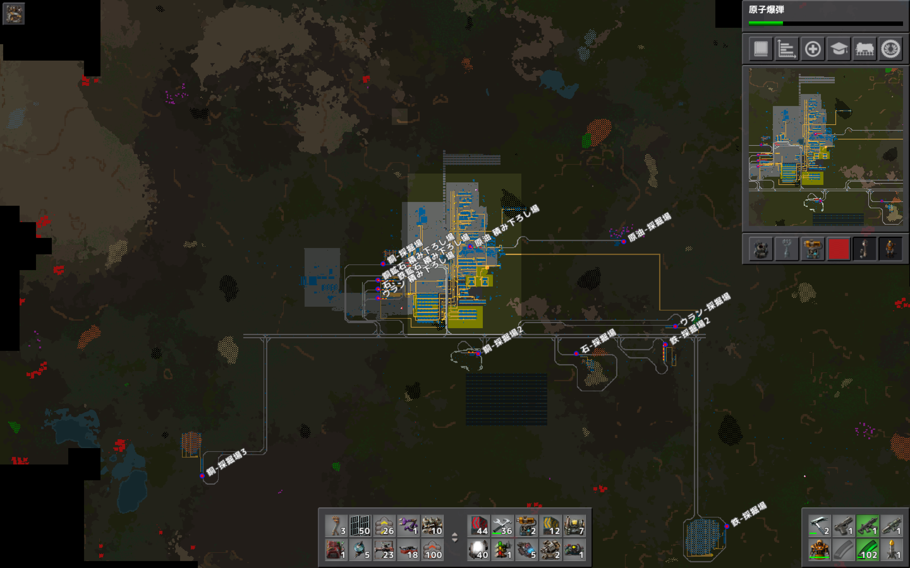

# 惑星探索日記まとめ
## プレイ時間
約100時間

## スクリーンキャプチャ数枚

## ゲームのレビュー
Factorio自体は数年前にプレイしたことがあり、その際にはハマり過ぎて気付くと朝までやってしまうほどでした。  
今回改めてFactorioをプレイしてみてもそれは変わらず、やめるタイミングが中々見つけられず予定より1~2時間ほど長くプレイしてしまう日がほとんどでした。 
Factorioの何がそこまで時間を奪うのかというと、延々と続くトライアンドエラーです。  
1つのアイテムを作るために2~4種類のアイテムが必要になり、それが複雑化してくると一度全部破壊して組み直す。さらに優秀な運搬方法が開発されると再度破壊し組み直す。研究に必要なサイエンスパックが増えて生産ラインを増築。それが複雑化してくると一度全部破壊して組み直す。そうこうしていると気付くと資材不足に。資材不足を解消するために列車が必要になり……。  
このように、やることが次々と出てきます。  
このトライアンドエラーがひたすらに楽しいんです。トライアンドエラーが進むごとに扱えるアイテムの種類や量が増えていき、出来なかったことが出来る様になっていく。そして何より、各ネットワーク知識が増えていきそれを実践的に使える快感が醍醐味だと思います。

## プレイに関して気をつけたこと
【序盤】  
プレイ経験があったので、まずはマップ生成時にある程度確認して建設計画を建ててから始めました。そして、ある程度期間を決めないとやり過ぎてしまうことは確実なのでこの惑星にいる期間は14日間としました。  
序盤は必要な研究を優先的に進めたり、先回りで生産ラインや資源の準備をしながら進めていきました。  
生産ラインの拡張性を意識したので、資源を生産ラインの横に縦長に伸ばし、生産ラインは横長に伸ばせるように組みました。  
また、生産ラインの複雑化を避けるために役割分けをしっかりしました。具体的には精練所を一箇所にまとめ、生産ラインを最終生産ライン毎に区切るという形です。

【中盤】  
ゲームクリアに向けてロケットサイトの研究と開発を進めつつ、ロケットに必要なアイテムの生産ラインを同時に組みました。  
序盤で拡張性を意識していたのでロケットサイト用のラインを増やす際も躓くことなく実装できました。  
資源が不足してきたので、列車で資源を運ぶことにしました。ここからは、知識が追いつかないのとチュートリアルでも説明されていない箇所が多くなってきたので、wikiなどで調べてから実装するように意識しました。  

【終盤】  
ゲームクリア後は回路ネットワークと原子力ネットワークを弄る事にしました。これでFactorioにある全ネットワークを触れたと思います。  
特に回路ネットワークは生産量の制御や列車に轢かれないための踏切などの実用的なものから、ライトの点滅の制御でドット絵を描くなど実用性が無いものまであって面白いです。実際にハートやカービィを描いてそれを点滅させたり歩く動作をさせたりしました。  
終盤はとにかく楽しく遊ぶことを意識して力を抜いてプレイしました。  

## このチャレンジに関する感想
Factorioは元々大好きなゲームだったので、このチャレンジは常に楽しみながら参加できました。  
14日間という縛りを自分で付けましたがあまり早くクリアすることはあまり意識していなく、完成したマップを見て頂いた時にどこで何をしているかが一目で分かるということを特に意識していました。今度はマルチプレイでもプレイしてみたいです。  

また14日間の記録を本サイトにまとめていますので、是非ご覧ください！
