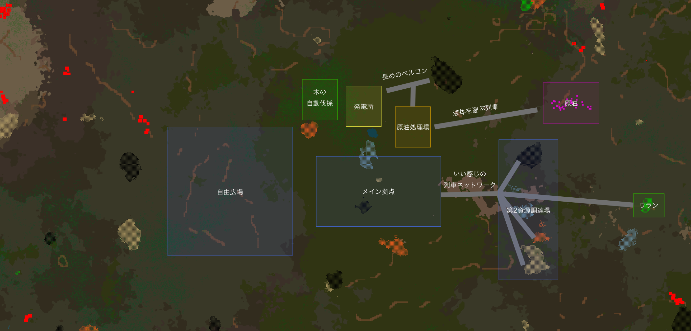

# 惑星探索日記0日目

既ゲームプレイ時間42時間

マップ生成時のプラン  

まず画面中央に「石炭」「鉄鉱石」中央下「銅鉱石」があるのでここがメイン拠点になりそう。  
このマップは水場が極端に少ないので原油の生成位置が位置を確認。  
最寄の原油は画面右側になるので、発電所の位置は水場の上、原油の処理場は水場右にすると良さそう。  
発電所が水場上になるとボイラーに必要ならメイン拠点の石炭が遠くなるのでいっそ右上の石炭を利用することに。距離的に列車が必要なほどでも無さそうなので長めのベルトコンベアーで運搬する。  
それに合わせて原油処理場でも石炭が必要なのでそっちにも伸ばしておく。  
これで電気は用意できて、資源が豊富なので列車の開発を優先しながら暫くは作業できそう。

メイン拠点での開発が進み資源が枯渇してきたら右側の第2資源調達場に列車ネットワークを組み資源を拠点に引き込む。 
その際に、奥のウランも持ってきたい。（ウランの使い方は知らない）

メイン拠点左上に森林があり、手動伐採は厳しそうなのでロボットネットワークで自動伐採を目指す。（噂によると出来るらしい）

左側のスペースは基本的に何も無い上に更に左に行ってもうまみが少ないので、作業スペースが少なくなったら使うための自由広場に。

Factorioは経験上無限に出来てしまうゲームなので、14日以内にゲームクリアを目指していきます。（クリアしても14日は続けます）
