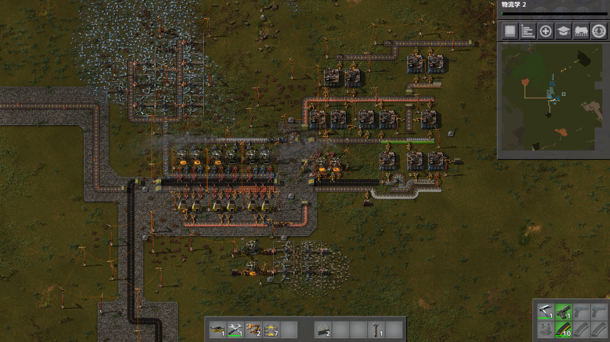
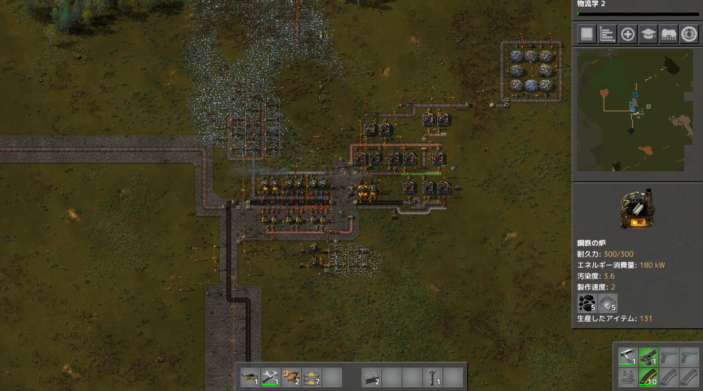

# 惑星探索日記1日目
初日は鉄鉱石と石炭を一箇所に集めて鉄板生成の自動化から  
銅鉱石が遠い位置にあったり、発電所と石炭が遠い問題があるので序盤はベルトコンベアーをひたすら作りながら拠点の整備をした  
銅鉱石と発電所右上のルートはベルトコンベアーで繋いだが、想像以上に長くなってしまったのでいずれは列車に変更したい  
普通の地面のままだと歩きにくいので石レンガを敷きながら作業をしています（ピースフルモードなので壁に石レンガを使わなくて良いのが便利）  
いずれは生産ルートによって地面の色分けをしてみたいです。

鉄板と銅板の製錬所はチュートリアルであった形を踏襲しながら、右側ではサイエンスパックの生成を行っています
サイエンスパックの機構のしたでは列車制作に向けた下準備を行っています

サイエンスパックは研究所の周りを環状にグルグルするようにしています
こうすることで無駄な詰まりがなくなり、サイエンスパックが研究所に行き届きやすくなりました

プレイ時間2時間
プレイに関して気を付けたこと
序盤でやるべきことはわかっているので先回り先回りで資源の準備や生産ルートの設備を行ってなるべく短い時間で進めるように心がけた
開発の選択も列車が早く使えるように、現状必要の無い開発はしないように選択した
2日目はエンジンの開発+線路を敷く必要があり鋼材が大量にいるので鋼材生産ルートを確保したい
