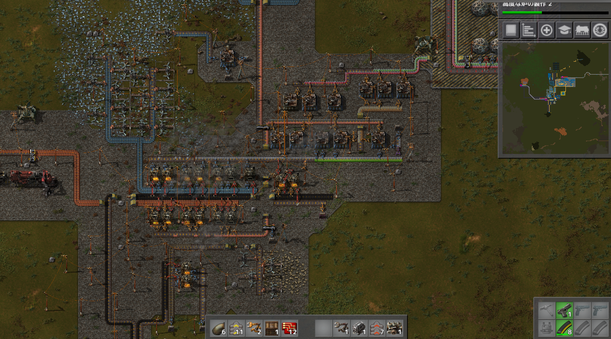
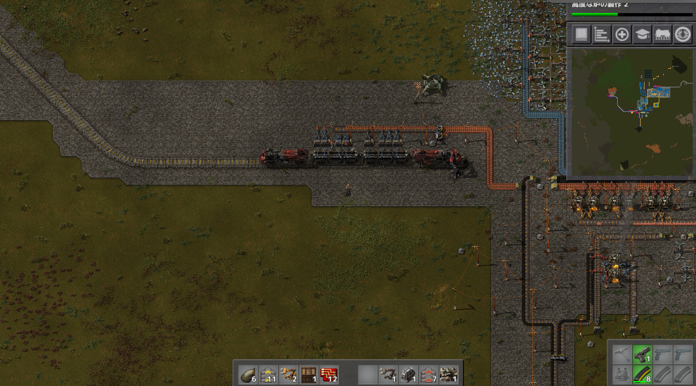
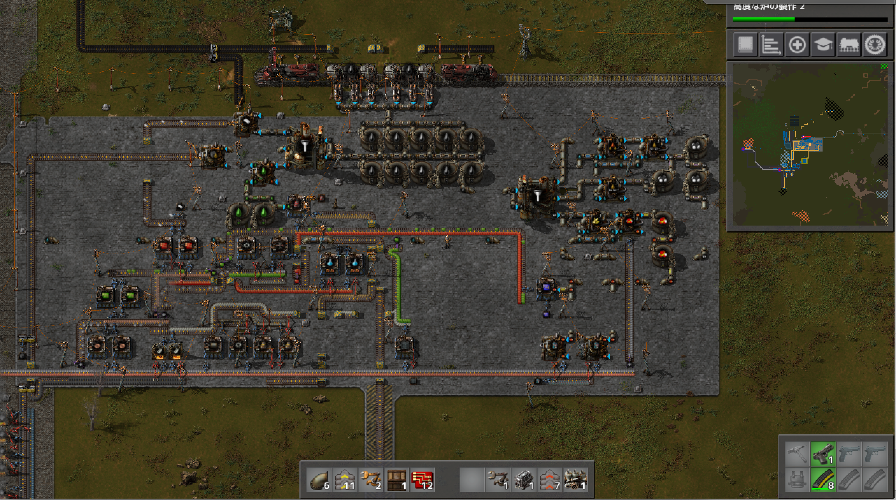
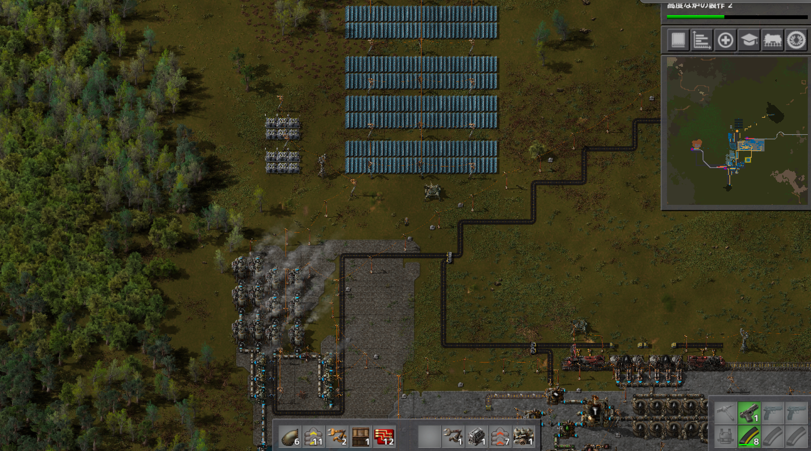
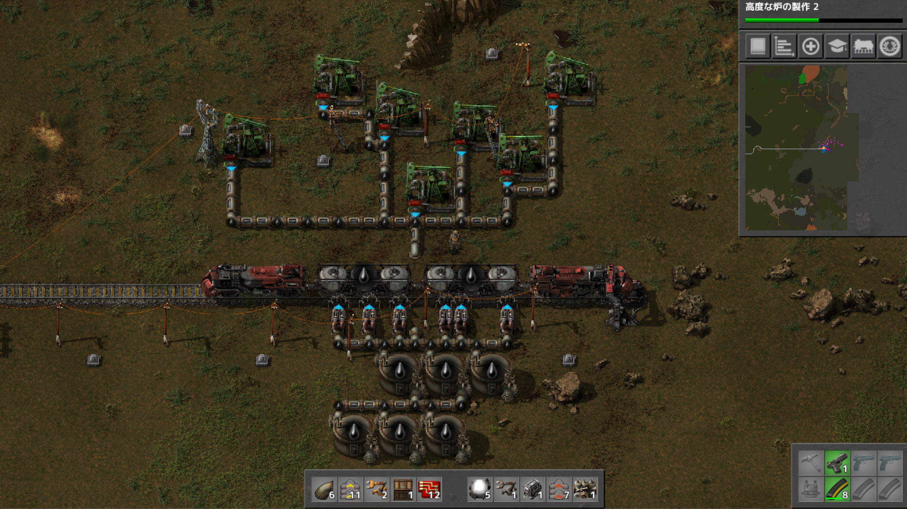

# 惑星探索日記2日目
２日目は会社が午後半休なので長時間プレイしてしまいました… 
本当に時間が一瞬で溶ける… 
まずメインの拠点が鉄板と銅板精錬を行いつつ最終生産物としてはサイエンスパック赤緑出すというものなので初日から役割が変わっていないです  

銅鉱石の運搬方法をベルトコンベアーから列車に変更しました。  
基本的に需要と供給がアンバランスなので列車が止まりがちです。もっと消費量を増やさないと… 

原油処理場も本格的に稼働し始めました。  
原油の採掘場が遠い位置にあるため列車で原油の運搬を行っています。  
こう見ると右側のごちゃごちゃ感が酷いので整理したいです。  
またメインの拠点といい感じに合流させて大きい拠点にしていきたいです。  
地面はコンクリートにしています  

発電所に蓄電所とソーラーパネルの導入を行いました。  
電気の必要量の知識が無いのでとりあえずはこのままで停電したら拡張する形で対応していく予定です。  

原油の採掘場の様子。  
上で取った原油を下のタンクに貯めておき、列車が来たら渡すというものです  

プレイに関して気を付けたこと  
初日と同じく次の次の開発までを意識しながら必要な生産ラインを作ることを意識しました。また、分からないことは直ぐに調べて対応するようにしました。タンク貨物の使い方やボイラーと蒸気機関の比率など  
自分の作ったものをスクショで振り返ると直したい箇所が沢山出てくるので最適解を探しながら続きをプレイしようと思います。  
ここからはチュートリアルを超えた内容になってくるので、手探り状態が増えると思いますがスクラップ＆ビルドで美しい構造にしていきたいです（最早、趣味の世界）
