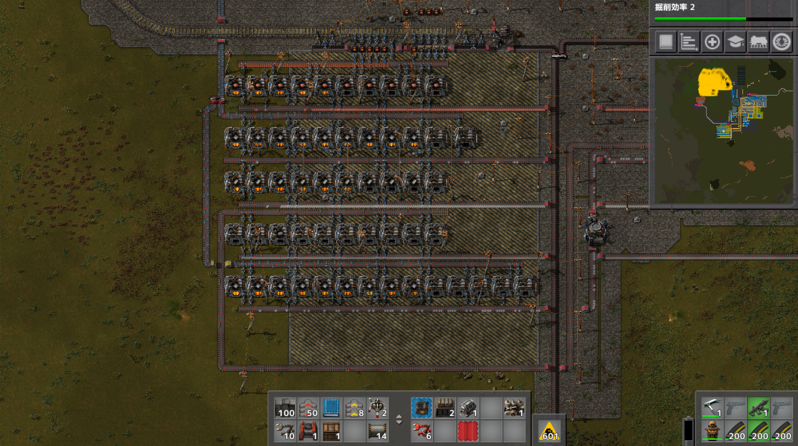
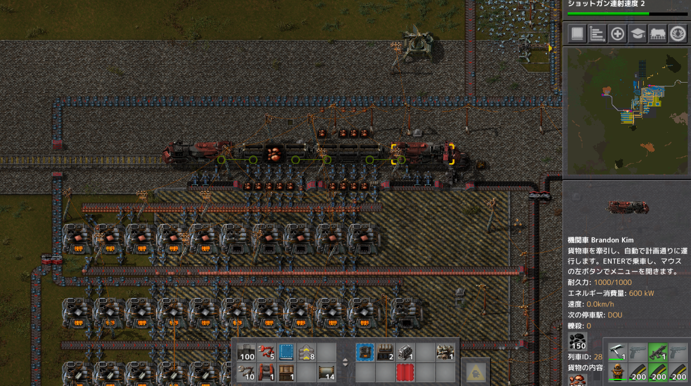
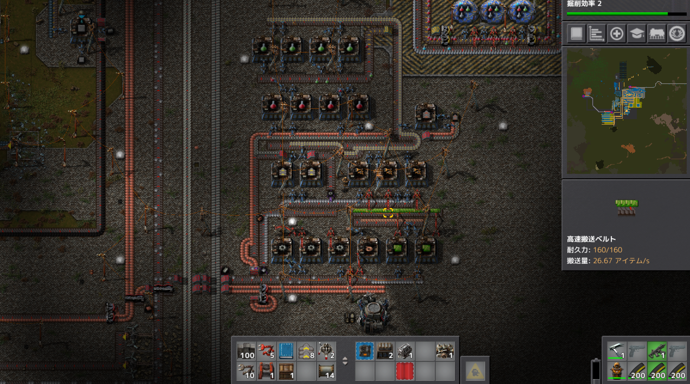
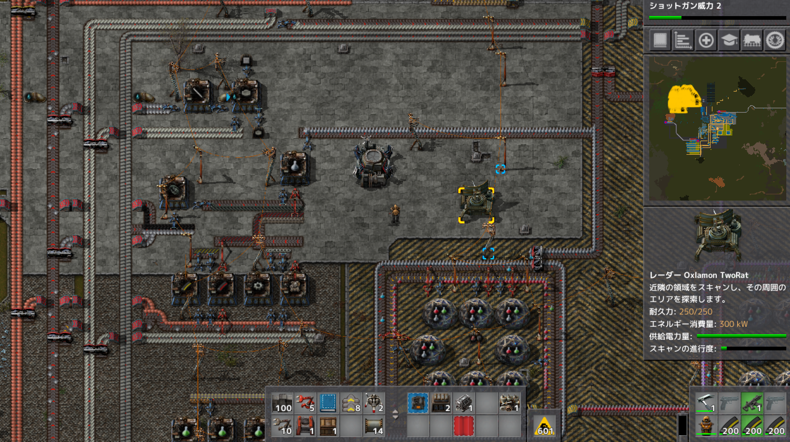
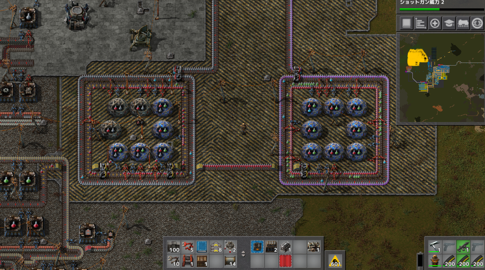
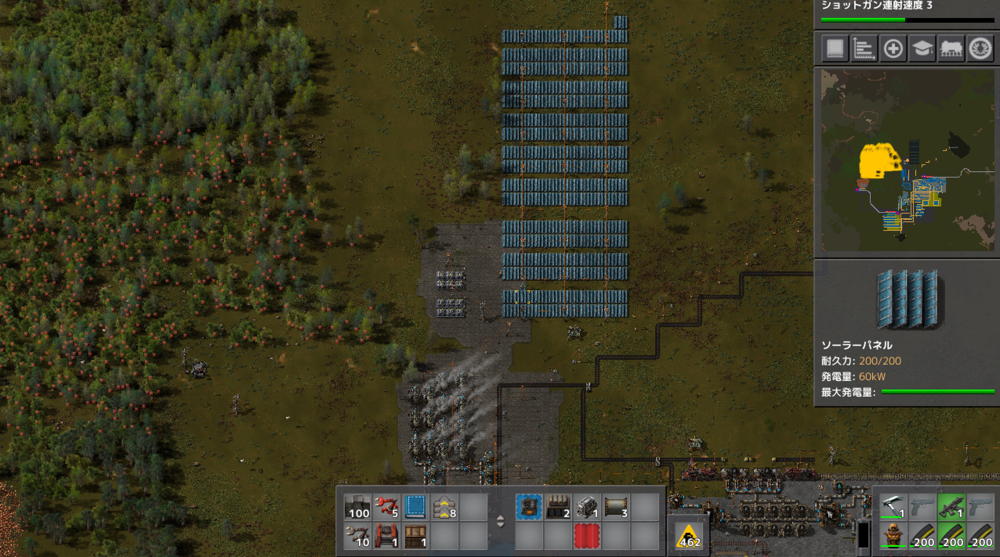
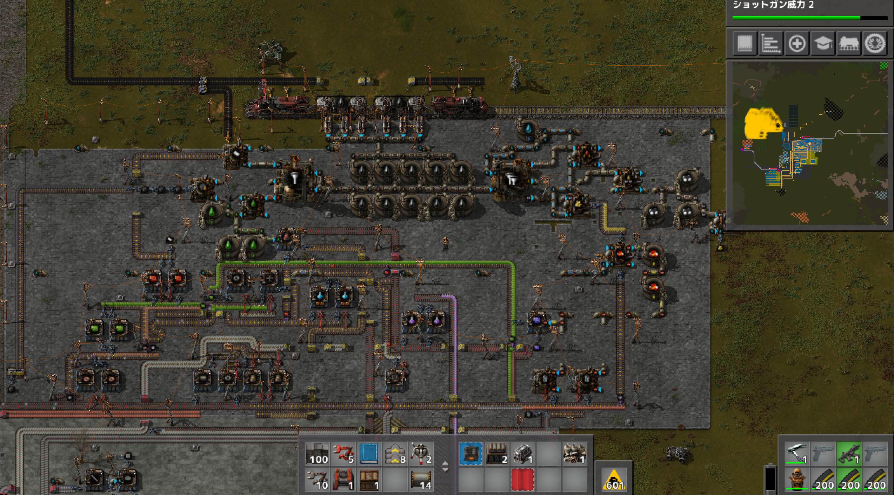
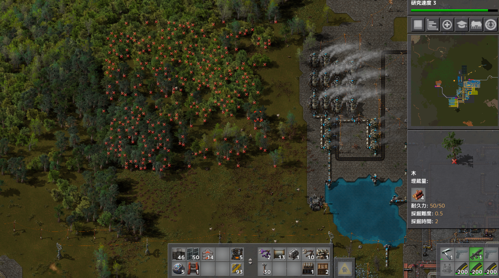

# 惑星探索日記3日目
今日は休日だったので一日中籠もってやっていました。  
電気炉が使えるようになったので燃料レーンを考える必要がなくなったのと、鉄板、銅板レーンを整理したかったので製錬所を作りました。  

列車は今後のこと考えて上に鉄鉱石、下に銅鉱石を降ろせるようにレーンを組みました

製錬所から出た素材は左側の縦長のレーンに乗ります  
レーンの間隔は2マスずつ空いていて分配器と地下ベルトコンベアが使えるようにしています 
赤緑サイエンスパックのレーンも調整して生産効率UPと位置変更を行いました。  

赤緑サイエンスパックの上に軍事サイエンスパックを作るレーンを用意し、研究所へのベルトコンベアへと繋げています  
現状軍事サイエンスパックを使う開発をそこまで行っていないので小さめに作っています。  

研究所は開発に必要な色の組み合わせが赤緑青黒と赤緑青紫というが見えて来たので二箇所に増設しました  

発電所はソーラーパネルの増設で発電量が増加しましたが、夜間の発電量が少なくなっているので蓄電所を増築する必要があります

原油処理場は青サイエンスパックと紫サイエンスパックが最終生産物になっていますが、青のサイエンスパックの生産性が低いので要修正です。  
固形燃料が余りまくって他の生産を止めてしまう問題もあるので、次はここら辺を一気にリフォームして行きたいです

ロボットネットワークを導入したので森林伐採作業をお願いしています  
実は製錬所の建築もロボットに任せました  
とても便利  

プレイ時間7時間 
プレイに関して気を付けたこと  
ここら辺から自分が何をするべきかが分からなくなってくるので、常に目的を持ちながら行動することを心がけています  
そして、ある程度のものが生産できるようになったので、生産ラインの修正をスクラップ＆ビルドで行っていきます  
赤緑サイエンスパックはある程度出来たので原油処理場の修正を行いたいですその際は青、紫サイエンスパックの生産が止まるという想定で軍事系の開発を最優先で行いつつという感じ。