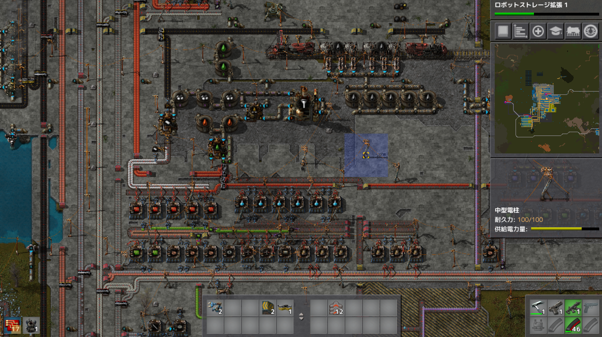

# 惑星探索日記4日目
今日も休日なので1日中惑星探索していました。 
電気炉による鉄板の生産が間に合わなくなってきたので拡張しました。  
製錬所の作り的に下に伸ばしていけば理論上無限に拡張が可能なので次は銅板の生産を増やしていきます  

青サイエンスパックの生産ラインがぐちゃぐちゃだったのでスッキリするように変更しました。  
石油周りの配管の処理が上手く出来ていないので改修したいです（4回目くらい…）  

青サイエンスパックの横に黄色サイエンスパックの生産ラインを構築。  
拡張性を担保するのであれば横に広げるのではなく縦方向に広げるべきなのですが、石炭のレーンが邪魔していると、ソーラーパネル群も邪魔だったのでとりあえずここに構築、後々にに移動させるプラン。（建築ロボット様様）

青、黄色サイエンスパックの上には紫サイエンスパックの生産ラインを構築。  
発展基盤のラインを再構築するのは冗長になってしまうので、下の生産ラインからの再利用を行いました。更に上（黄色サイエンスパック）でも再利用出来るよう伸ばしておく。  
右への拡張性を担保することを心がけました。  

拠点の規模拡大につき、ソーラーパネルの場所が邪魔になったので移動、拡大をロボットネットワークに任せました。  
ソーラーパネルの生産ラインを作って、貯蔵チェストに入れるとロボットが設置してくれる。可愛い＆便利。  

プレイ時間5時間   
プレイに関して気を付けたこと  
生産ラインの作り方が自分なりに出来てきたので、生産ラインの整理を行っています。  
その際に生産の最適解がわかっていないので、なるべく好きな時に好きなだけ伸ばせるように意識しました。  
また、最終生産物毎に生産ラインを分けることで後から見ても何をするためのラインなのか混乱しないように意識しています。  
