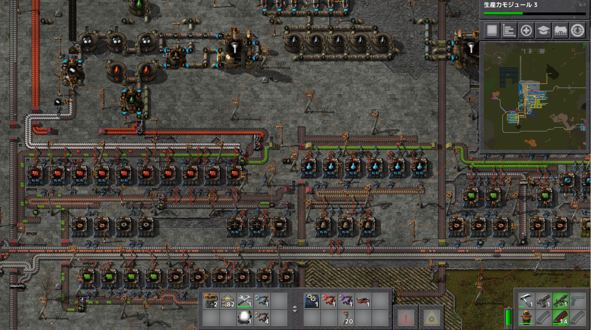
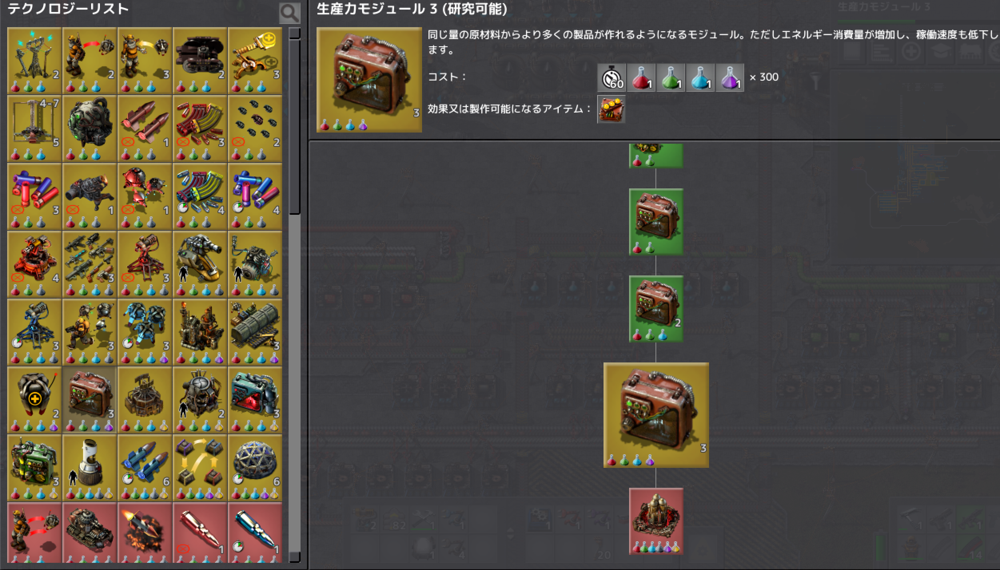

# 惑星探索日記5日目
今日は平日なので少しだけプレイ  
青サイエンスパック、黄色サイエンスパックに対する発展基盤の生産が間に合っていなかったので、発展基盤を10基で作ることにしました。  
後で知ったのですが発展基盤の生産効率的に電子基板x2基に対して発展基盤x12基がちょうどいいらしいです。これのバランスが取れてないのであれば、銅板or鉄板の生産が足りていない…。ということで明日からは鉄板と銅板の生産を見直すことにします。  

ゲームクリアに必要なロケットサイロまで後少し！  
なので、ロケットサイロに必要な部品も今の段階から用意しておきます  

プレイ時間2時間   
プレイに関して気を付けたこと  
今回行ったのは生産ラインの改修ですが、事前知識があればもっと効率的なラインを作れたと思うので今後改修する時には事前に調べてから行うべきという学びを得ました。
