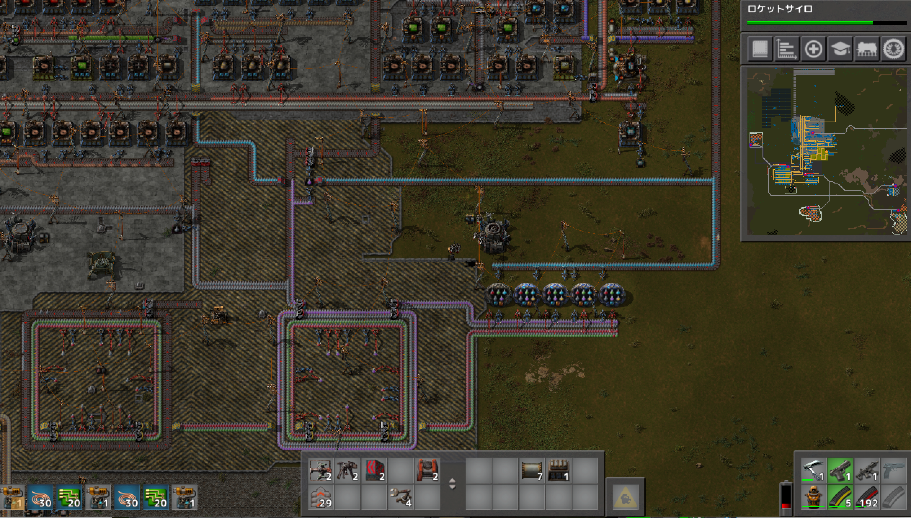
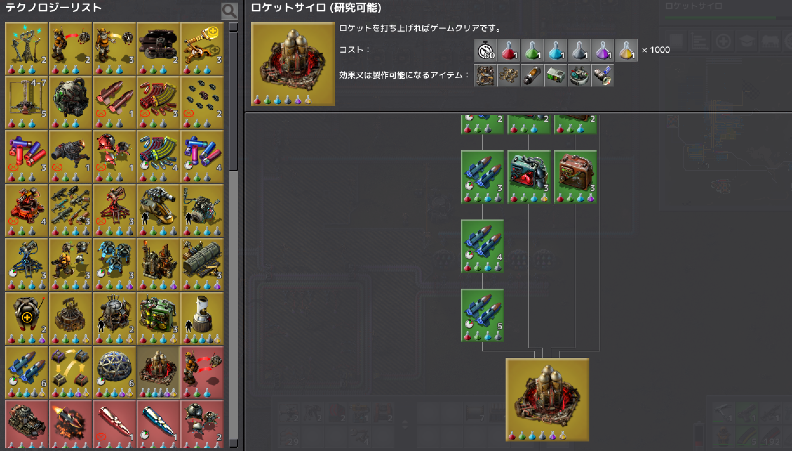
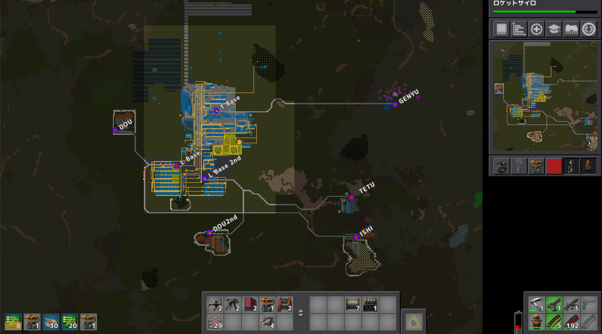

# 惑星探索日記6日目
ロケットサイロの開発が行えるようになったので、研究所を６種類のサイエンスパックを入れられる形に変更しました。かなーり不格好なので環状で6種類入れられる形を模索します。 
黄色サイエンスパックの開発に時間がかかるので黄色の拡張・改修も視野に入れつつ…   

ロケットサイロを建てたことがないので、楽しみ。  

メイン拠点の鉄鉱石・石の枯渇が見えて来たので、鉄道で繋げる場所を増やしました。  
列車ネットワークの理解が乏しいので良い感じのネットワークを構築出来るように試行錯誤していきます。  

プレイ時間3時間  
プレイに関して気を付けたこと  
鉄鉱石の枯渇により鉄道の重要性が上がってきたので、鉄道ネットワークをいい感じにしたい反面、直ぐに資源の供給が必要という気持ちもあるので不格好な感じになってしまいました。
ロケットサイロサイロが出来てからが長いという噂も聞いたので頑張って行きたいです。  
後、各採掘場にバイターが襲って来てしまうので武力も付けていきたい
