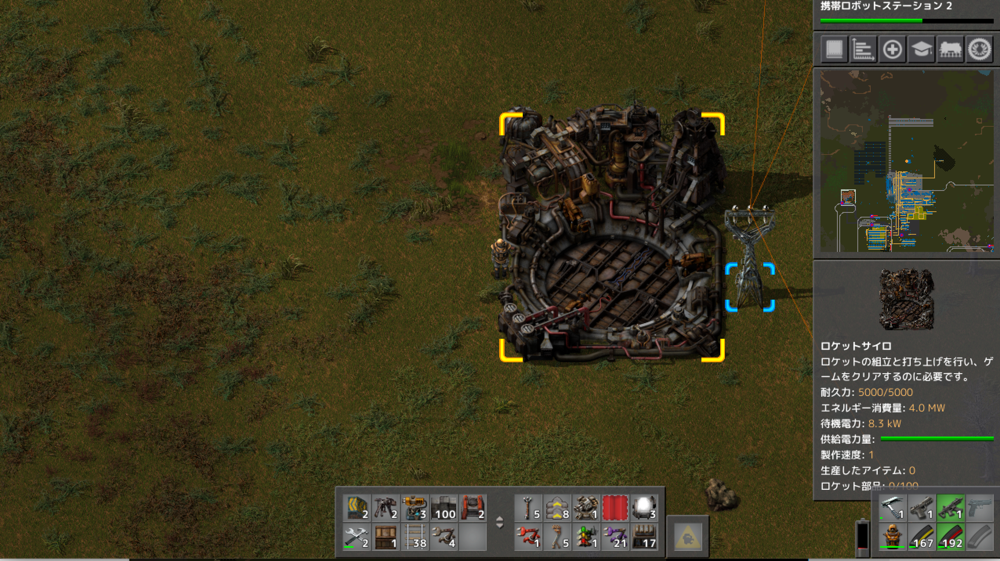
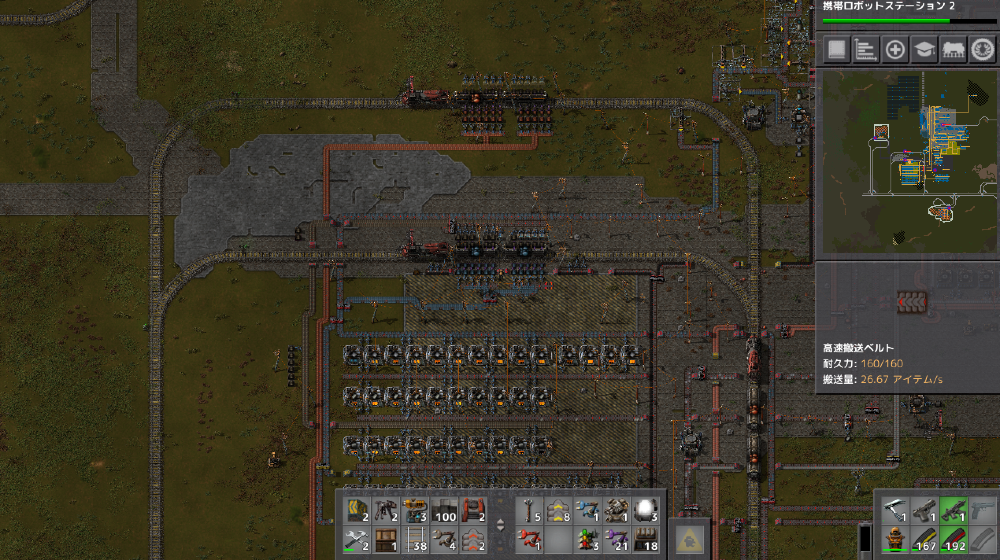
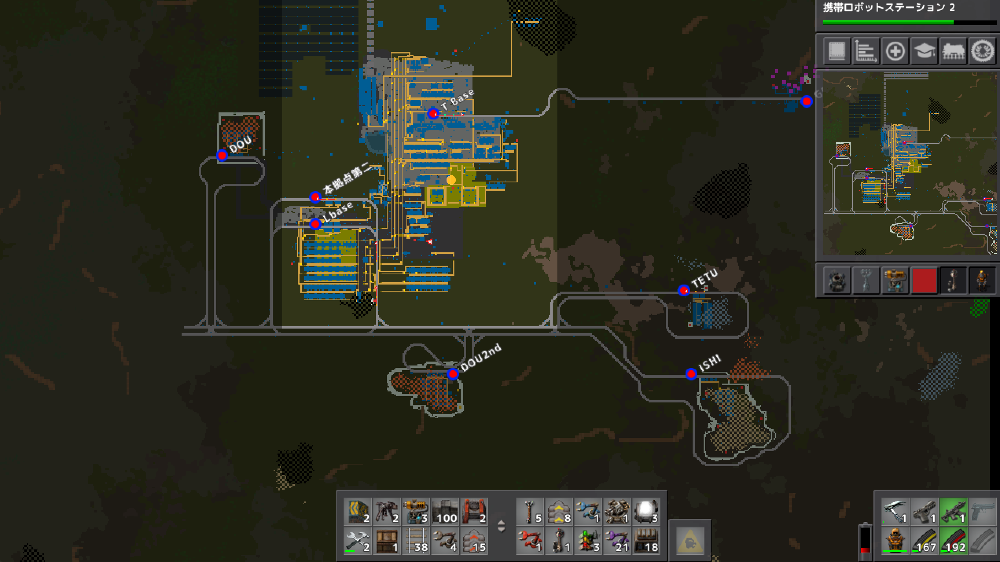
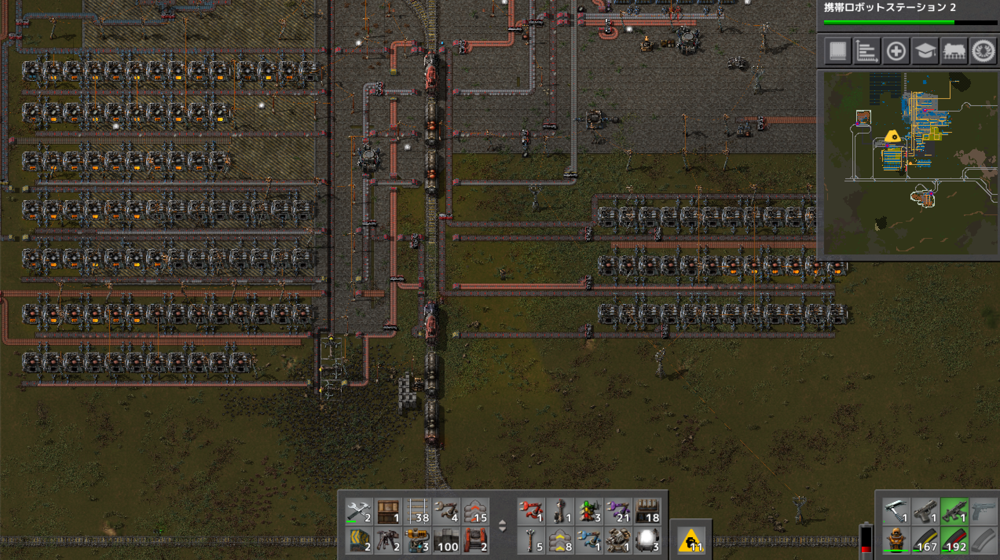

# 惑星探索日記7日目
ロケットサイロの開発が完了し素材も予め用意しておいたものを使って直ぐに制作も完了しました。  
設置してみたらとてつもなくデカイ。  
ロケット部品の積込ラインの最終地点になるので設置場所は再検討。  

初期位置の鉄鉱石がいよいよ空前の灯状態なので鉄道駅の整備を開始。

鉄道は今までの双方向線路を辞めて、一方向にし内回り線、外回り線を作りました。  
いい感じ  
駅の名前に日本語を使えるらしいので使って見ましたがもっと分かりやすいネーミングを検討中  

ただ、ここに電車が詰まってしまっているので待避所を用意する必要がありそう。  
参考サイト  
[https://wiki.factorio.com/Tutorial:Train_signals/ja](https://wiki.factorio.com/Tutorial:Train_signals/ja)

プレイ時間３時間  
プレイに関して気を付けたこと  
上記のサイトが青写真のコードを提供してくれていたので、鉄道のT字路は青写真を元に作りました。 
また、メールに指定があってピースフルモードが設定されていなかったのでコンソールからゲームモードをピースフルに設定し直しました。（実績が貰えなくなったらしい）  
列車ネットワークは理解するのに時間がかかってしまったので、サンドボックスモードで挙動を確認してから実装を行いました。想像通りに動くと楽しいので列車ネットワークをもう少し弄りたいです。  
列車の積み下ろしで詰まってしまうことで列車全体が詰まってしまう問題もあるので、今の駅を待避所にし、製錬所の左側を駅にして製錬所を増築、ロケットサイロ生産ラインを作り供給と消費のバランスをとっていきたい。  

