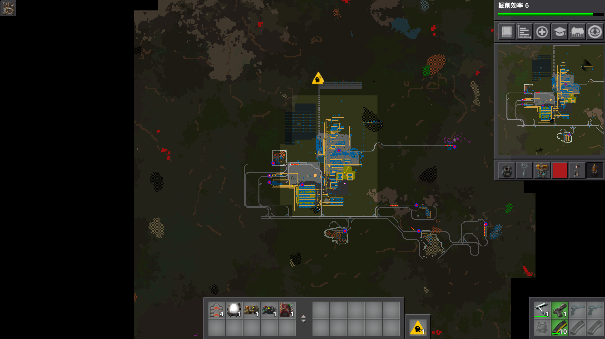
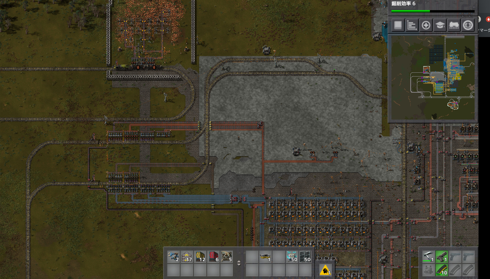
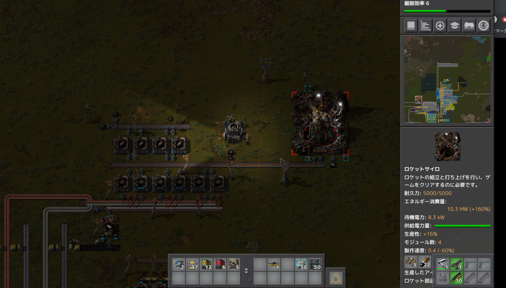
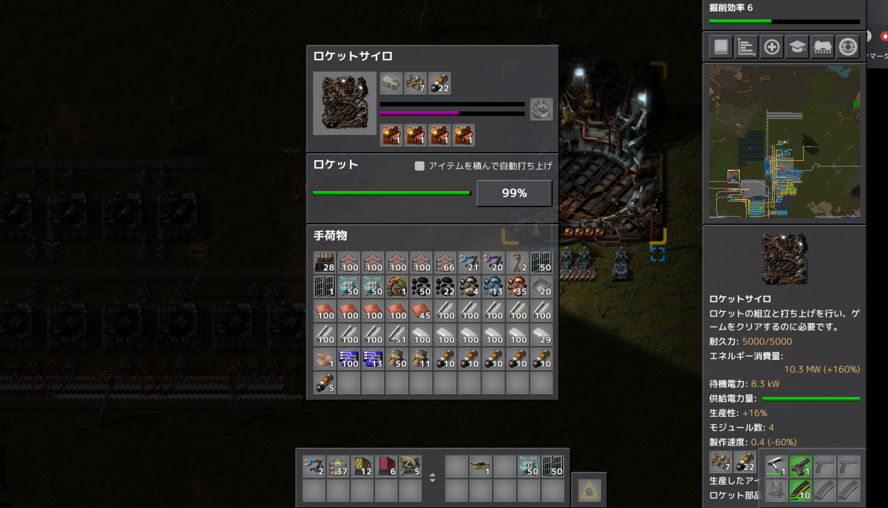
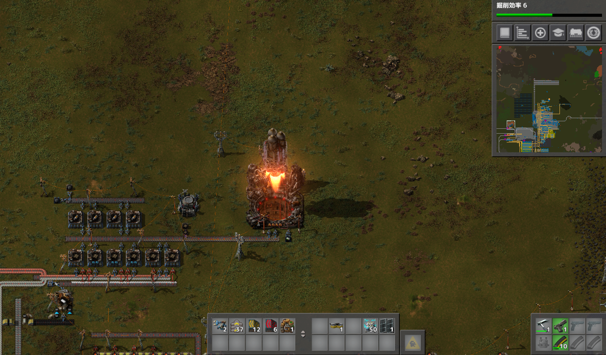

# 惑星探索日記8日目
ロケットサイロが出来て、更に資源が必要になってくるみたいなので、右下の鉄鉱石まで線路を拡張しました。

それに伴い待避所を作成。
積み下ろし場所を右にずらして、製錬所の拡張を可能にしました。（おそらく拡張の必要は無さそう）

次に、ロケットサイロの部品制作レーンを作成。  
ロケット燃料の原料である固形燃料は余りに余っていたので、物流ロボットに運んで貰い加工。  
断熱材はプラスチックの生産ラインだけ確保し、後の素材はいつものように流し込む。  
ロケット制御ユニットは黄色サイエンスパックと素材が被っているので、余剰素材を借りて作成それを物流ロボットに運んでもらうことにしました。  

ロケットに載せる衛星を作っていたらいつの間にか99%に！早い

衛星を載っけて

バビューン

思いの外あっさりクリア！

プレイ時間6時間   
プレイに関して気を付けたこと  
始めてフリープレイモードでのゲームクリアを達成できました！やった！嬉しい！  
精錬した途中制作物を縦長のレーンに流す方式が思いの外上手くいったのでロケットサイロのラインも問題なく作れたので個人的には満足でした。  
14日目にこの画面を見る予定だったのでかなり早めに達成出来たと思います。ゲームはクリアしましたが、ウランの加工、核発電所、回路ネットワーク、バイターの巣の殲滅などなど出来ていないことも多いので14日まで遊び尽くそうと思います