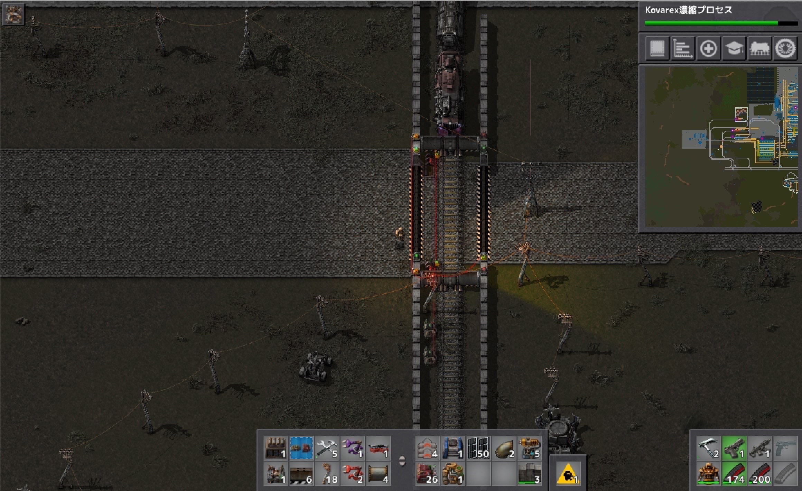

# 惑星探索日記10日目
回路ネットワークで遊んでみました！  
上の数字がピコピコしているものはチェスト内のアイテム数を数える回路。  
千の桁百の桁…それぞれを算術回路で取得してその数字を元に光らせるランプを切替えています。（これは積み下ろされた鉄鉱石の数を表示しているところ） 
下のハートは定数回路をループさせることでランプを点滅させる回路です。  
具体的に説明すると定数回路→条件回路→条件回路→算術回路→ランプと繋がっており。  
定数回路をループを条件回路2個で0~60の幅に決めています。 
ランプは「いずれか>0」という条件で光るので、算術回路で0の出力の幅を広げて消灯時間を伸ばしています。 

こちらは踏切です。  
信号の色を操作して、プレイヤーが渡る際は信号は赤に。  
鉄道が渡っている際はプレイヤー側のゲートが開かないようになっています  

新しいゲームが始まったみたいで楽しかったです。
