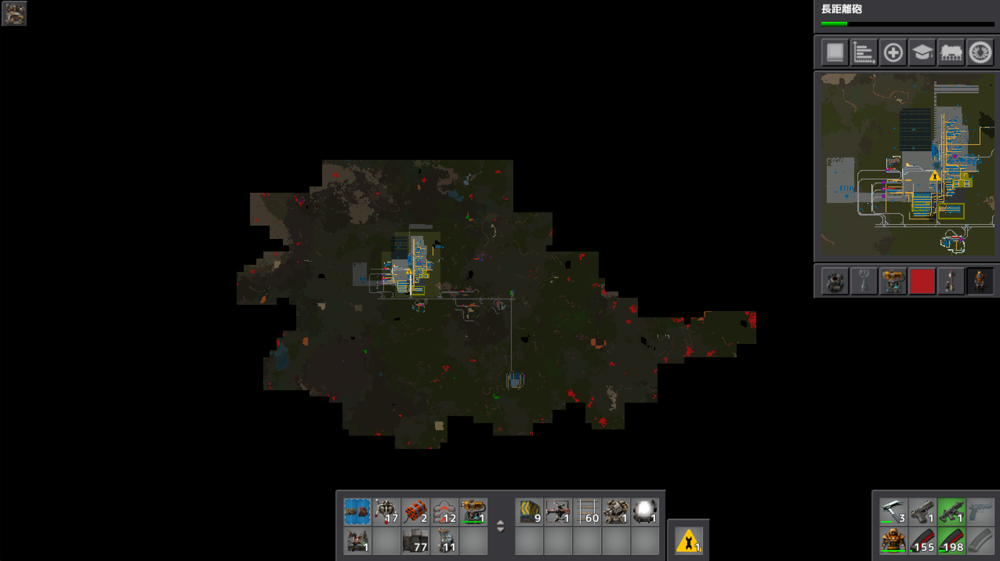
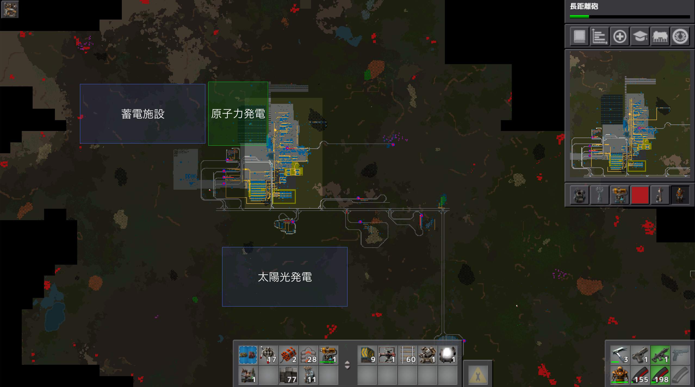

# 惑星探索日記11日目
今日は気分転換にバイターの巣の駆逐作業＆鉄鉱石の枯渇問題解消のため鉄鉱石採掘場探しの旅に出ました。

なんと13Mくらい埋まっている鉄鉱石の採掘場をまんまと発見することに成功！ 
早速、鉄道と掘削機を設置。  
下に流していい感じに分配して積み込む形に。

上の画像を見て頂ければ分かる通り掘削機の量がエグいので原子力発電に手を出すことにしました。（現状、夜の発電量が不足しているのもあり）  
ウランは近くにあったのでこれ掘削。  
ウランを掘るには何故か硫酸が必要なのでドラム缶に詰めて持って来ましたがコスパが悪い気がしているのでパイプで運ぶことにするかもしれないです。  

今後の予定としては以下の通り。  
現在ある太陽光発電はすべて取り除き原子力発電所に置き換え（水源の確保のため）。  
太陽光発電は拠点下のデッドスペースに移動＆規模拡大  
蓄電施設も同じく、移動＆規模拡大。  
これによって拠点の縦方向への拡張が可能になりました！  

意外とまだやることがある…