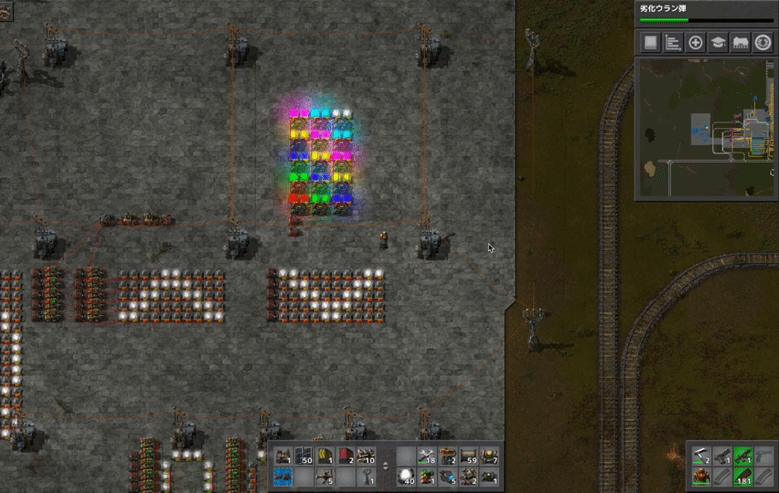

# 惑星探索日記13日目
色々している間にKovarex濃縮プロセスが動くようになり原子炉へ核燃料の安定供給が可能になりました！ 

原子炉一台でタービンが6~7基くらい動く程度の熱が出来るようなので8基設置してみました（？）  
とりあえずすべて動いており、これだけでソーラーパネル1000個くらいと同等の発電量を確保出来たので原子力発電万歳。  

色々している間の「色々」ですが、回路ネットワークを弄ってました。  
上のカラフルなライトは２個の定数回路と複数の算術回路だけで色の出し分けが出来るよというものです。公式wikiにのっていたので作ってみました。  
その下の矢印のようなものは0~9のシグナルでライトのオンオフを管理するものです。 
これに条件回路と定数回路のループロジックを組み合わせて一定時間で向きが変わる矢印を作りました。  

原子力発電も完了し、回路ネットワークの理解も深まってきてfactorioをかなり遊び尽くせている感じがしています！
最終日に作りたいものがあるのでそれを完成させて、この星を出ることにします。
