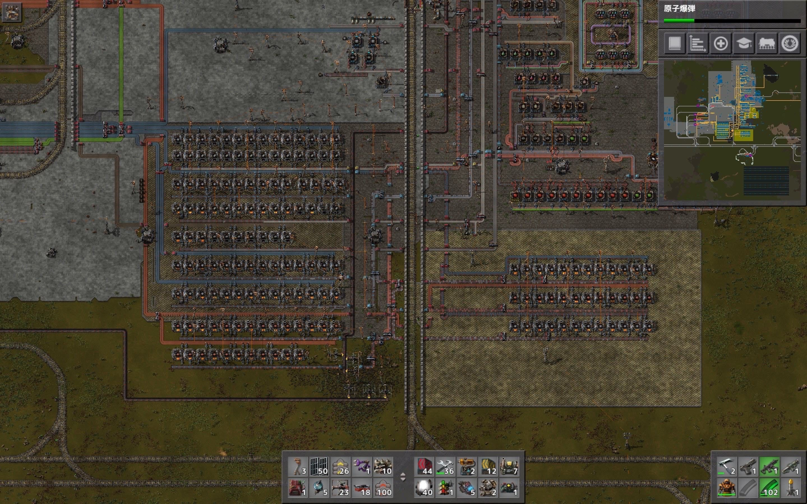
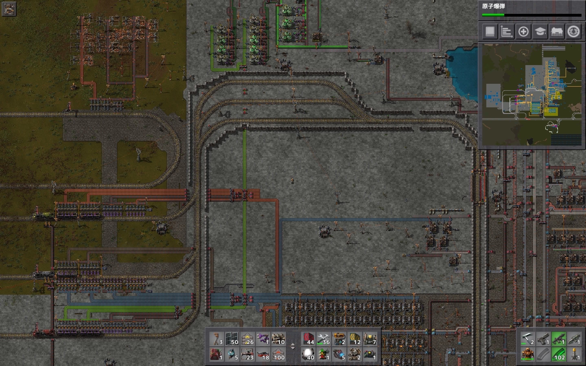
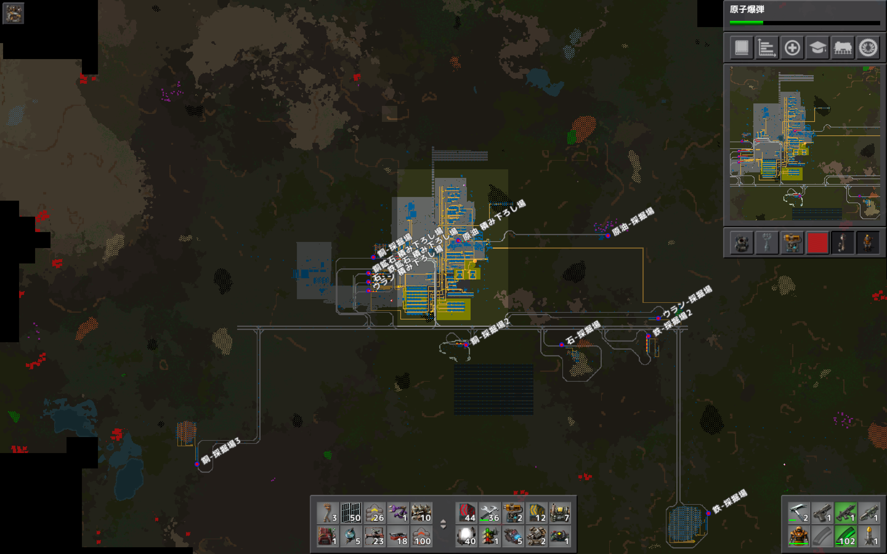
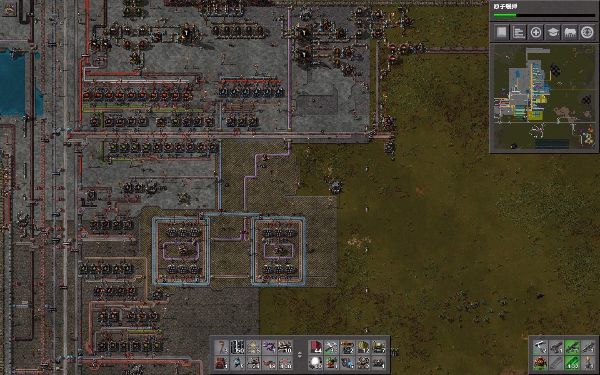
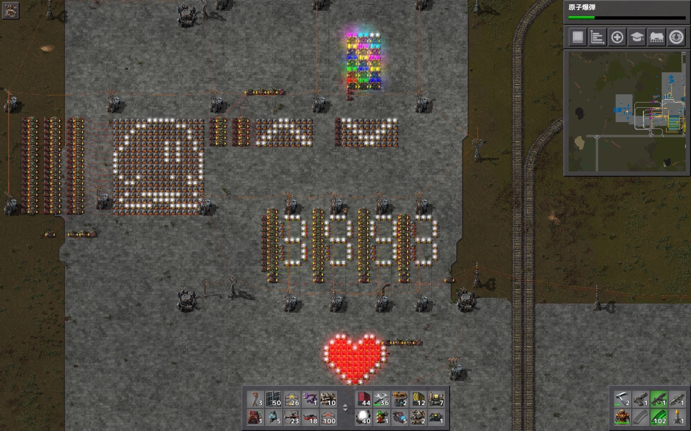

# 惑星探索日記14日目
この惑星での最終日です。  
今回作ったものを軽く振り返って終わることにします。  
まずは、製錬所。  
列車から降ろされた資源を電気炉でひたすら焼く施設です。  
ど真ん中を列車がぶった斬っている中々斬新なデザインになりました。轢かれるのが怖いので、石レンガで塞いで踏切も作りました。  

その左上には列車の積み下ろし所と待合所です。  
待合所が無いと列車が詰まりデッドロックが起きてしまうので作りました。幸い今回のマップでは一回もデッドロックは起こらずに済みました！  

列車の各駅は「資源名+役割」でネーミングしました。 
具体的には「鉄 採掘場」「鉄 積み下ろし所」という具合です。

生産ラインです。  
下から順に、赤緑サイエンスパック、黒サイエンスパック、青サイエンスパック、紫サイエンスパック、黄色サイエンスパックという具合に基本的に最終生産物毎に区切って設計しています。  
例外として、発展基盤の余剰分は左の資源レーンに流し、黄色サイエンスパックに再利用しています。電子基板と発展基盤は要求数が多いので資源レーンの序盤に電子基盤用の生産ラインを用意するべきだったかもしれません。  
それとプロパンガスの要求量も意外と多く、プロパン生産ラインが他のラインの拡張を妨げているので原油加工場はもっと離れた所に作るべきでした。  

最後は回路ネットワークの遊び場です！  
下のハートは定数回路のループによる点滅  
数字はチェストの容量の可視化  
矢印はグリットでのライトの点灯制御  
カラフルなライトは算術回路による同一配線上での色の出し分け  
左にいるカービィは、…？

こいつ動くぞ…！ 
定数回路のループによる点滅+グリットでのライトの点灯制御の組み合わせでカービィを歩かせて見ました！ 
なんで、カービィかって？  
惑星探索日記≒惑星≒星≒星のカービィ 
ね？  
本当はカラーで実装したかったのですがどうしても仕組みが思い付かず白黒（GB版）のカービィになりました。  

以上、えびの惑星探索日記でした。
何か忘れている気がしますが、この惑星に星のカービィを布教することができたので地球に帰りたいと思います！
ここまで読んで頂きありがとうございました。
また会いましょう。
